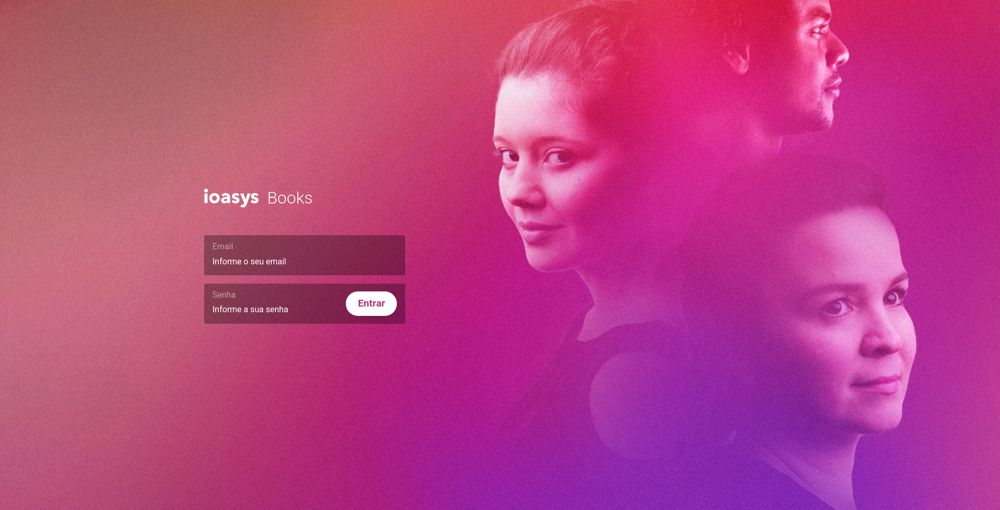

<h1 align="center">
    
</h1>

<h4 align="center">
  ioasys Camp 2021
</h4>

<p align="center">
  
</p>

<p align="center">
  <a href="#layout">Layout</a>&nbsp;&nbsp;&nbsp;|&nbsp;&nbsp;&nbsp;
  <a href="#projeto">Projeto</a>&nbsp;&nbsp;&nbsp;|&nbsp;&nbsp;&nbsp;
  <a href="#tecnologias">Tecnologias</a>&nbsp;&nbsp;&nbsp;|&nbsp;&nbsp;&nbsp;
  <a href="#iniciando-o-ambiente-de-desenvolvimento">Iniciando o ambiente de desenvolvimento</a>&nbsp;&nbsp;&nbsp;|&nbsp;&nbsp;&nbsp;
  <a href="#licença">Licença</a>
</p>

<p align="center">
  
</p>

<br />

## Layout

A aplicação foi prototipada no [Figma](https://www.figma.com/) e pode ser acessada clicando [aqui](https://www.figma.com/file/YXuqJUzNZcR7GveJfVWCKo/Desafio-Frontend%3A-ioasys-books?node-id=0%3A1).

## Projeto

O ioasys Books é uma aplicação simples onde o usuário pode realizar login e visualizar os livros cadastrados na plataforma naquele momento. Além de visualizar uma listagem paginada de todo os livros, ele pode selecionar um desses livros e ter acesso a mais detalhes do livro escolhido.

O site está no ar e pode ser acessado clicando [aqui](https://vinisilvag-ioasys.netlify.app/).

Nota: O deploy foi feito de forma gratuita no Netlify. Por isso, pode ser que sejam encontrados alguns problemas ao longo do uso da aplicação, principalmente com relação aos processos de autenticação do usuário. Dessa forma, aconselho que, para a melhor experiência no site, o projeto seja executado localmente, através do guia da sessão de setup do [ambiente de desenvolvimento](#iniciando-o-ambiente-de-desenvolvimento).

## Tecnologias

- [Create React App](https://pt-br.reactjs.org/docs/create-a-new-react-app.html) com [Typescript](https://www.typescriptlang.org/)
- [styled-components](https://styled-components.com/)
- [React Hook Form](https://react-hook-form.com/) e [Yup](https://www.npmjs.com/package/yup)
- [React Helmet](https://www.npmjs.com/package/react-helmet-async)
- [React Toastify](https://fkhadra.github.io/react-toastify/introduction)
- [ESLint](https://eslint.org/) e [Prettier](https://prettier.io/)
- [React Testing Library](https://testing-library.com/docs/react-testing-library/intro/)
- [Context API](https://pt-br.reactjs.org/docs/context.html)

## Iniciando o ambiente de desenvolvimento

```bash
git clone https://github.com/vinisilvag/ioasys-books.git
cd ioasys-books

yarn
yarn start
# ou
npm install
npm run start
```

## Licença

Esse projeto está sob a licença MIT. Veja o arquivo [LICENSE](LICENSE) para mais detalhes.
